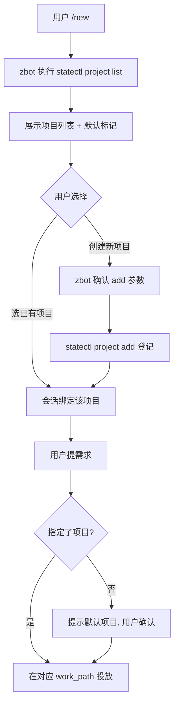

# 项目工作路径解耦设计（zteam 独立于项目）

> 版本：v1.0（2026-08-19）｜状态：待用户评审
> 目标：zteam 资产层（脚本/角色/文档）与项目数据层（需求/产物）**物理解耦**——项目可在任意指定工作路径开发，zteam 存放位置无关。

---

## §1 目标与边界

- **解耦**：zteam = 纯资产层（git 仓：docs/roles/scripts/skills + projects.json）；项目数据不再存放于 `zteam/workspace/{项目}/`，而是**用户指定工作路径**（默认 `~/project/{项目}/`）；
- **唯一真理源**：项目映射表 `projects.json` 记录所有 zteam 服务过的项目——项目存在性、工作路径、最新版本的**唯一权威**；
- **修改铁律**：映射表只能**用户明确修改**时经脚本写入（AI 不能擅改）；所有写操作审计留档；
- **非目标**：不改流水线状态机/调度逻辑本身（仅改造路径解析层）。

## §2 项目映射表（唯一真理源）

### 2.1 存储

```
zteam/projects.json（资产层，git 跟踪，可 git 恢复）
```

### 2.2 结构

```json
{
  "projects": [
    {
      "name": "snake-linux",
      "created_at": "2026-08-19T10:00:00+08:00",
      "latest_version": "v2.0.0",
      "work_path": "/home/zyzs/project/snake-linux",
      "default": true
    }
  ],
  "updated_at": "2026-08-19T10:00:00+08:00"
}
```

| 字段 | 语义 | 写者 |
|---|---|---|
| `name` | 项目名（`[A-Za-z0-9_-]`）| `project add`（用户明确）|
| `created_at` | 项目成立时间 | `project add` 自动 |
| `latest_version` | 最新版本 | **版本 released 时脚本自动同步**（confirm_guide 收口）|
| `work_path` | 项目数据根（完整结构 input/analysis/code/...）| `project add/setpath`（用户明确）|
| `default` | 全局默认项目标记（**唯一**）| `project default`（用户明确）|

### 2.3 修改权限铁律（守护）

- **AI 禁止直接改 projects.json**；所有写操作经 `statectl project ...` 命令（单写者 + 锁 + 审计）；
- **用户明确**语义：zbot 请求 → 用户确认（`确认`/`可以`）→ zbot 执行；或用户命令行直接执行；
- 审计：`workspace/logs/pipeline.log`（现审计通道）记录 `PROJECT_ADD/PROJECT_SETPATH/PROJECT_DEFAULT` 谁/何时/动作。

## §3 脚本接口（`statectl project` 命令族）

| 命令 | 用途 | zbot 场景 | 权限 |
|---|---|---|---|
| `project list` | 列全部项目（含 default 标记/最新版本/工作路径）| `/new` 必跑，供用户选择 | 只读 |
| `project info {name}` | 单项目详情 | 用户问某项目 | 只读 |
| `project add {name} {work_path?}` | 登记新项目（路径缺省=`~/project/{name}`）| 用户要开发新项目 | **用户确认** |
| `project setpath {name} {path}` | 迁移工作路径 | 项目换目录 | **用户确认** |
| `project default {name}` | 设全局默认项目（唯一标记）| 用户指定常用项目 | **用户确认** |
| `project rm {name}` | 移除登记（**仅解除登记，不删数据**）| 项目退役 | **用户确认** |

- 输出格式：zbot 可解析的纯文本（每项目一行：`{name} | {latest_version} | {work_path} | [默认]`）；
- `project list` 退出码 0 且有项目 → 正常；空表 → 提示"尚无项目，可创建"；
- `project info/setpath/default/rm` 对不存在项目 → 非 0 + 明确报错。

## §4 路径解析改造（核心）

```
现状：project_dir(project) = zteam/workspace/{project}
改造：project_dir(project) = 查 projects.json → projects[name].work_path
      （未登记 → 报错 "项目未登记，请先 statectl project add"——所有 tick/worker 触发该提示即暴露）
```

- `WORKSPACE_DIR` 语义收敛为**全局数据目录**（仅存 logs/ 审计 + status.lock）；项目数据全部走 work_path；
- 涉及函数：`project_dir / input_dir / stage_output / versions_path / modules_path / spawn_worker(日志目录) / diagnose` 等——统一经映射表解析；
- **兼容**：`projects.json` 缺失/未登记 → 明确报错（不静默回退 workspace），强制先登记（新项目首条需求投放也要求先 `project add`）。

## §5 zbot 交互流程

### 5.1 /new 会话（强制初始化）

```
用户 /new
  → zbot 第一步：执行 `statectl project list`（脚本返回全部项目）
  → zbot 展示：项目列表 + 默认项目（default 标记）
  → 用户选择项目（或创建新项目）
  → zbot 会话内临时绑定所选项目（不写表）
```

### 5.2 需求沟通

```
用户："做一个 XX"
  → zbot 未指定项目？→ 提示默认项目（表 default）："当前默认项目是 {name}（v{latest}，{work_path}），在该项目下开发吗？"
  → 用户确认/改选 → zbot 在 {work_path}/input/ 投放需求
```

### 5.3 新项目创建

```
用户："新项目 {name}，路径 {path}（可缺省=~/project/{name}）"
  → zbot 执行 project add 前向用户确认（"确认登记？"）
  → 确认 → statectl project add → 返回结果
  → 数据目录（input/ 等）由首个需求投放时自动创建
```

### 5.4 换路径 / 设默认

```
用户："把 {name} 移到 {path}" → zbot 确认 → project setpath
用户："默认项目设为 {name}" → zbot 确认 → project default
```



## §6 守护规则

1. **表写操作唯一入口** = `statectl project ...`（单写者 + 项目锁 + 迁移校验 + 审计）；
2. **用户明确**：zbot 场景必须用户确认后执行；命令行 = 用户直接执行（本身即明确）；
3. **latest_version 自动同步**：版本 `confirm_guide` 收口时 → 脚本更新 `projects[name].latest_version`（与 D8 归档同批，AI 不自保证）；
4. **default 唯一性**：设 default 时清除其他项目 default 标记（脚本强制）；
5. **路径校验**：add/setpath 的 work_path 必须是绝对路径且非 zteam 内部路径（防污染 git 仓）；
6. **rm 只解除登记**：不删 work_path 数据（数据安全）。

## §7 存量迁移（一次性）

```
1. 备份：cp -a zteam/workspace/ → ~/cyx/zteam-workspace-backup-{日期}/（含未跟踪 logs/status.db）
2. 登记：4 存量项目（snake-linux/tetris/gomoku/pacman）写入 projects.json
         work_path = ~/project/{项目}/ ——注意：**不搬数据**，仅登记（数据在备份里，需要时再迁）
3. 清空：git rm -r zteam/workspace/*（项目数据移出 zteam git 仓）；保留 workspace/logs（审计）+ 空结构
4. 验证：diagnose 全绿 + project list 正确 + 新需求投放走 work_path
```

> 说明：存量数据只**备份不迁移**（避免搬动大目录）；新开发在 `~/project/{项目}/` 全新开始；旧数据需要时从备份恢复（cp 到 work_path 即可）。

## §8 实施分期

| 期 | 内容 | 验证 |
|---|---|---|
| M1 | projects.json + `project` 命令族（list/info/add/setpath/default/rm）+ 权限/审计 | ad-hoc：增删改查/权限拒绝/审计 |
| M2 | 路径解析改造（project_dir 查表）+ 未登记报错 | ad-hoc：查表命中/未登记报错 |
| M3 | latest_version 自动同步 + default 唯一性 + 路径校验 | ad-hoc：confirm_guide 同步/唯一性 |
| M4 | zbot 流程（bot.md /new 必跑 list + 默认项目提示）+ 存量迁移备份 | ad-hoc + 用户实操 |

## 待用户确认的附加点

1. `~/cyx` 备份目录名建议 `~/cyx/zteam-workspace-backup-20260819/`（或你指定）；
2. `project rm` 保留（可能不需要——仅解除登记防误删数据）。
